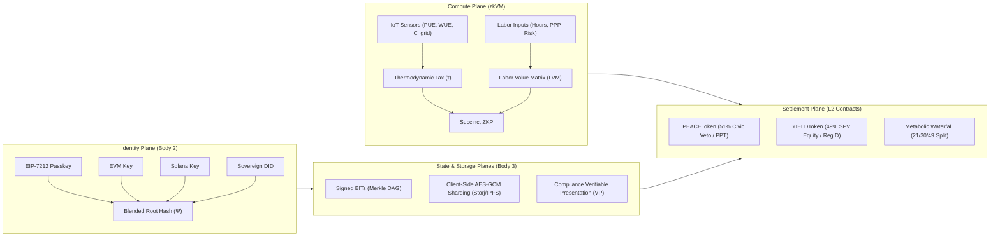

# The Promethean Sovereign Substrate & Decentralized Holographic Chain
## Technical Whitepaper v1.0.0 (Sovereign Edition)

**Abstract:**  
As human governance models face institutional stagnation and hyper-centralized cloud infrastructure introduces single points of systemic capture, the emergence of parallel sovereign jurisdictions—Network States—requires a new computing and economic physics. This whitepaper introduces the **Promethean Sovereign Substrate**, a verifiable, zero-trust, peer-to-peer (P2P) computing and governance protocol. By integrating **Holographic State Projections** via local Merkle Directed Acyclic Graphs (DAGs), **Progressive Biometric Key Blending** (EIP-7212/WebAuthn), **Edge zkVM Thermodynamic & Labor Compute** (RISC Zero / SP1), **Dual-Class Civic-Economic Tokenomics** (`PEACEToken` soulbound veto power and `YIELDToken` SEC Reg D 506(c) restricted equity), and the **21/30/49 Metabolic Waterfall**, the Promethean Substrate establishes a resilient, decentralized, and ecologically grounded foundation for post-dominion human societies.

---

## 1. Theoretical Foundations & The Holographic Paradigm

### 1.1 The Vulnerability of Centralized Cloud Jurisdictions
Modern digital institutions routinely conflate *interface accessibility* with *jurisdictional sovereignty*. The reliance on centralized relational databases (PostgreSQL, MySQL) and hyper-scaler cloud infrastructure (AWS, GCP) produces fundamental systemic risks:
1. **Jurisdictional Extraterritoriality:** Cloud servers reside within legacy nation-state territorial jurisdictions, making centralized databases subject to unilateral seizure, subpoena, or administrative shutdown.
2. **Plutocratic Governance Capture:** Traditional Web3 governance models couple voting power directly to fungible, transferable tokens ($1\text{ token} = 1\text{ vote}$), allowing concentrated financial capital to subjugate civic governance.
3. **Detachment from Physical Thermodynamics:** Digital economic expansion often ignores the physical constraints of power grids, water tables, and localized carbon intensity.

### 1.2 The Holographic State Model
In optical holography, every fragment of a holographic plate contains sufficient structural information to reconstruct the entire global image. The **Holographic Chain** applies this principle to distributed state machines:

$$\text{Global State Root } \Psi = \mathcal{M}\Big(\bigcup_{i=1}^{N} \text{BIT}_i\Big)$$

Rather than querying a centralized remote endpoint, each network node maintains a **local projection screen** (embedded SQLite or IndexedDB) that ingests cryptographically signed **Basic Information Timestamps (BITs)**. State transitions propagate via probabilistic gossip over WebRTC peer-to-peer channels (DIDComm v2), enabling nodes to continue operating, transacting, and governing even during complete wide-area network partitions.

```
       [Citizen Node A] <======== WebRTC P2P Gossip ========> [Citizen Node B]
              |                                                      |
    [Local Merkle DAG Cache]                               [Local Merkle DAG Cache]
              |                                                      |
              +------------------> [Global State Ψ] <----------------+
                                           |
                                  [zkVM Proof Ingestion]
                                           |
                             [OP Stack L2 Settlement Layer]
```

---

## 2. The Four Substrate Planes



---

## 3. The Identity Plane: Progressive Biometric Key Blending

To prevent the user-experience friction of seed phrases while avoiding custodial Web2 logins, the Sovereign Substrate introduces **Progressive Biometric Key Blending**.

### 3.1 Biometric Secure Enclave Generation
When a citizen registers on an edge device (mobile or desktop), client-side JavaScript calls the **WebAuthn / EIP-7212** API. The hardware secure enclave (Apple Secure Enclave, Android StrongBox) generates a secp256r1/P-256 key pair that never leaves the silicon. This key pair deploys a gasless **ERC-4337 Sovereign Smart Account** on-chain.

### 3.2 Holographic Blending Equation
To link legacy wallets (EVM, Solana) and Decentralized Identifiers (DIDs) without public on-chain correlation, all keys are combined client-side into the **Holographic Blended Hash ($\Psi$)**:

$$\Psi = \mathcal{H}\Big(\text{DID}_{\text{Sovereign}} \parallel \mathcal{H}(\text{Biometric Passkey}) \parallel \mathcal{H}(\text{EVM Address}) \parallel \mathcal{H}(\text{Solana Address})\Big)$$

Where $\mathcal{H}$ represents the SHA-256 / Keccak-256 cryptographic hash function. Citizens can generate zero-knowledge membership proofs against $\Psi$ to authenticate transactions across heterogeneous chains without revealing their underlying biometric or real-world identities.

---

## 4. The Compute Plane: Verifiable zkVM Edge Computing

All off-chain evaluations—including environmental impact assessments and labor equity allocations—are executed inside a **Zero-Knowledge Virtual Machine (zkVM)** running RISC Zero or SP1 bytecode.

### 4.1 Thermodynamic Degradation Tax ($\tau$)
Network state enclaves enforce ecological sustainability through a deterministic exergy tax levied on physical computational infrastructure:

$$\tau = L_b \cdot \left[1 + w_P \cdot (\text{PUE} - 1.0) + w_W \cdot \left(\frac{\text{WUE}}{\kappa}\right) + w_C \cdot C_{\text{grid}}\right]$$

* $L_b$: Base lease rate per compute rack or facility module.
* $\text{PUE}$: Power Usage Effectiveness ($P_{\text{total}} / P_{\text{IT}}$).
* $\text{WUE}$: Water Usage Effectiveness (Liters / kWh).
* $\kappa$: Localized sustainable water table replenishment coefficient.
* $C_{\text{grid}}$: Real-time grid carbon intensity ($\text{gCO}_2\text{e} / \text{kWh}$).
* $w_P, w_W, w_C$: Dimensionless weight coefficients calibrated to local bioregional ecologies.

The zkVM ingests verified IoT sensor signatures, executes fixed-point integer arithmetic, and produces a succinct Zero-Knowledge Proof (ZKP) certifying that $\tau$ was computed strictly according to constitutional parameters without disclosing proprietary datacenter metrics.

### 4.2 Labor Value Matrix (LVM)
Worker-owner equity allocations are computed algorithmically based on verifiable contributions:

$$\text{Equity}_{\text{Worker}} = \sum_{i=1}^{M} \Big(h_i \cdot \text{PPP}_{\text{regional}} \cdot (1 + \rho_{\text{risk}})\Big)$$

where $h_i$ represents verified labor hours, $\text{PPP}$ scales purchasing power parity, and $\rho_{\text{risk}}$ reflects operational hazard premiums.

---

## 5. The Storage Plane: Decentralized Sharding & GDPR Erasure

### 5.1 Client-Side Fragment Sharding
Sensitive civil records, Private Placement Memorandums (PPMs), and land title deeds are processed entirely on the client before network transmission:
1. The client generates an ephemeral AES-256-GCM symmetric key.
2. The encrypted document is split into $N$ Reed-Solomon erasure-coded shards.
3. Shards are distributed across peer-to-peer storage networks (Storj, IPFS).

### 5.2 Verifiable Presentation (VP) Access Gating
Decryption keys are held in a threshold secret-sharing scheme that only reconstructs when a requesting party presents a cryptographic Verifiable Presentation (VP) proving adherence to the 8-step compliance state machine.

### 5.3 Cryptographic GDPR Article 17 Erasure
When a citizen invokes the "Right to be Forgotten":
1. The client issues an authenticated erasure directive to Storj satellite storage nodes.
2. The satellite nodes execute physical block scrubbing and return cryptographically signed **Deletion Receipts**.
3. The local client and peer nodes prune the CID metadata references from the global Merkle DAG.

---

## 6. On-Chain Settlement Contracts & Legal Matrix

The on-chain layer (deployed on the OP Stack L2) does not compute dynamic state; it serves as the immutable settlement arbiter for ZK-verified state transitions.

```
                    +--------------------------------+
                    |      Incoming Platform Yield   |
                    |        (Native Gas / USDC)     |
                    +--------------------------------+
                                   |
                                   v
                    +--------------------------------+
                    |    MetabolicWaterfall.sol      |
                    +--------------------------------+
                                   |
         +-------------------------+-------------------------+
         | 21%                     | 30%                     | 49%
         v                         v                         v
+------------------+     +--------------------+    +--------------------+
|  Host Treasury   |     |  Community Wealth  |    | Operational OpEx & |
| (MIDA / Regional |     |  Fund (Resident    |    | Investor Yield     |
|   Ministries)    |     |  Endowment Trust)  |    | (LP Tranches/Debt) |
+------------------+     +--------------------+    +--------------------+
```

### 6.1 `PEACEToken.sol`: Soulbound Civic Identity
* **Fulfills:** TPNS Limited Partnership Agreement (LPA) Section 4.2.
* **Function:** 51% civic voting veto power.
* **Mechanics:** Strictly non-transferable (`transfer`, `transferFrom`, `approve` revert with `SoulboundTokenNonTransferable`). Controlled exclusively by the Perpetual Purpose Trust (PPT).

### 6.2 `YIELDToken.sol`: SEC Regulation D 506(c) Asset Equity
* **Fulfills:** TPNS LPA Section 4.1.
* **Function:** 49% economic equity in Series SPVs.
* **Mechanics:** Compliant ERC-20 security token enforcing bidirectional whitelist validation (`isWhitelisted[msg.sender]` and `isWhitelisted[_to]`).

### 6.3 `MetabolicWaterfall.sol`: Tripartite Yield Routing
* **Fulfills:** Global Operating Playbook Section 5.2.
* **Function:** Automated, non-custodial disbursement of all gross protocol revenue:
  * **21% Host Fiscal Yield:** Routed directly to the host sovereign government (e.g., MIDA, territorial authorities) as a programmatic sovereign dividend.
  * **30% Community Wealth Fund:** Deposited into the local residents' perpetual purpose trust endowment.
  * **49% Operational OpEx & Yield:** Disbursed to facility management, maintenance, and `YIELDToken` equity holders, absorbing any integer division dust.

---

## 7. Security, Resilience & Radical Transparency

1. **Zero-Trust Client Projection:** No client depends on a centralized API gateway to establish validity; the state is derived from signed cryptographic Bit-logs.
2. **Bioregional Ecological Guardrails:** The integration of zkVM thermodynamic equations prevents the over-exploitation of local water tables and energy infrastructure.
3. **Non-Plutocratic Constitutional Stability:** The mathematical and smart contract separation between `PEACE` and `YIELD` ensures that financial liquidity cannot purchase civic sovereignty.

---

## 8. Conclusion

The **Promethean Sovereign Substrate** moves the concept of the Network State from speculative political philosophy into formal, verifiable computer science. By grounding civic sovereignty in biometric hardware, economic distributions in non-custodial smart contracts, and environmental stewardship in zero-knowledge thermodynamic proofs, the Substrate offers a robust, anti-fragile blueprint for self-governing parallel societies.
